## Developer log
A record for what have been accomplished in each development session
### Yuelong Li
#### 06/21
Experimented with a hello-world program of three with typescript. Successfully 
transpiled with tsc command and generated source mapping, but encountered problems when running the result on 
the browser. It turned out that the code generated was in commonjs standard and incompatible
with browsers. The modules weren't imported properly. Tried resolving the issue by using gulp,
but the import issue persisted, and the code still isn't runnable on browsers.

#### 06/22
While the issue persisted with importing, the general solutions on the internet weren't helping.
All the aforementioned modules such as Gulp and babelify that weren't creating any working solutions
were rage-deleted. After some digging, I realized that the imported code from "three/src/Three.js" file were in the 
es2015 standard instead of commonjs. However, in the other directory "three/build/three.js", the code was either
UMD or commonjs compatible, and can be directly imported as part of the `'three'` module
in the typescript files. With this fix, running `tsc` followed by `browserify` yields correctly functioning
es2015 codes. With the simple solution established, Gulp has been re-added to streamline and automate the build process.

#### 06/25
Setup source mapping for gulp build automation, and setup watch process with watchify, adopting from working solutions for the 
build process offered on typescript official site.

#### 07/03, 07/04
Conceptualized the "brain" of Pendulum, the Core module. It interacts with other parts of the software such as UI and Graphics by 
directly issuing them commands and queuing updates that will get executed asynchronously. It also hosts and closely monitors a 
virtual environment of mathematical variables and processes called the Environment module, the inner states of which can get extracted 
Core to be reflected via user interfaces. Environment runs on its own clock cycles which Core has access to for intervention or adjustments.
This is an important step toward a clearly defined architecture of Pendulum.

#### 07/09
Further designed the architecture of the Core module. Specified important mechanisms that Core.Env will use to construct the variable
dependencies and evaluate statement trees such as reference lists, contexts, and local variables.

#### 07/10
Finished specifications of key parts of Core, including reference list, context, function context, and statement resolutions.

#### 07/11
Put the previously designed html index page into work. Lined up imports of mathquill with the current project configuration. 
Changed ui.js into ui.ts and resolved all issues arising from the change. Currently mathquill visualization and typing is 
fully functioning on the UI panel, along with the rest of the pendulum user interface.

#### 07/12
Determined the conditions upon which a system of equations arises in place of the singled-out definitions for variables, namely
when cycles occur on the dependency graph of the variables. Designed algorithms for solving implicit definitions and systems of equations 
for Core. The algorithm's central idea is based on gradient descent.

#### 07/13
Created specifications for differential equation syntax and designed Core numerical solvers based on iterated Runge-Kutta and dynamic caching. Made minor
style adjustments to the index page.

#### 07/14
Encountered some strange problems with LaTeX rendering. The \sum and the \sqrt commands looked disproportional compared to previously achieved effects. Turned
out that the fonts folder in src/css/ was not properly copied into dist/css. The issue was resolved after fixing the build script.

#### 07/17
Devised and documented the working principles behind the parser module that turns TeX statements into statement trees. Made further specifications
of parts of the UI module such as definitions and label fields.

#### 07/18
Built a test runner for function construction out of statement trees in experiment.ts. It turns out that functions constructed using eval or hardcoded consistently 
performed about four times faster than that constructed using functional programming (avoiding if and switch statements). Evaluation functions constructed using
Function outperformed eval consistently by around 6%, and sometimes even beats the hard coded function, despite requiring an additional argument specifying context.
These testing results furthered my confidence in creating a pi-script based Core.

#### 07/19
When trying to import the orbitControl.js file written in es5, parse error was thrown stating that "ParseError: 'import' and 'export' may appear only with 'sourceType: module'." After
some search the solution should be adding a babel es2015 transformation to the browserify function in gulp-build. 

The problem with the error still persisted after adding the babelify transformation. A solution is provided here:
https://stackoverflow.com/questions/19444592/using-threejs-orbitcontols-in-typescript, where nicolaspanel wrote a ts-compatible orbit control
https://github.com/nicolaspanel/three-orbitcontrols-ts. 

With the previous solution, a different three module was imported and created upon build, resulting in the inability fo zooming function to identify the camera type. 
The final working solution was established by importing an older version of orbital controls stored in local director, 
and making THREE globally available in graphics.ts.

#### 07/20
Started implementing functionalities inside the graphics module. Created class structures for Canvas, Graph (abstract), and Cartesian Graph (extends graph). 

Graph takes care of all actions related to visualization of a particular THREE object, including vertex generation, face generation, material creation, geometry and 
mesh creation, and so on. The cartesian graph
relies on two layers of mapping to create the vertices, first the M(u,v)=>(x,y) map that takes care of the x,y locations of the vertices, with u,v ranging from 0 to 1 with 
specified densities determining the fineness of the mesh, and then the f(x,y)=>z map defining z coordinate of vertices. Mapping M(u,v) can be utilized to create conformal 
and constant local area meshes in the future. The important method populate is expected to be called by Core in the future to generate mesh based on the statements of a variable.

Canvas wraps around all canvas related objects, including THREE.scene, THREE.camera, the htmlDiv, and so on. It also holds the animation method for continuous rendering. 
With the combination of Canvas and Graph, one can quickly add a graph to the canvas by calling Canvas.addGraph(graph). This gives one the ability to manipulate the canvas 
imperatively, by calling methods that wrap around multiple function calls that achieve certain actions on the canvas. The Three objects inside Canvas are still publicly 
exposed, so one still have the option to operate on them directly. Canvas also listens for window resize events, so that it can adjust the renderer size accordingly.

By utilizing the conformal mapping M(u,v), successfully resolved the transparency issue that arises out of unsorted vertex z-buffers for self-overlapping geometries. By updating
the orientation of the conformal mapping to keep in sync with the camera orientation, I was able to get consistent transparency rendering without any flickering or sawtooth shaped
pixel overlays, without having to sort the depth-buffer explicitly. The time-complexity of each re-orientation, which requires re-population of the vertex buffer, is exactly
O(1), namely one update per 90 degree region, and the process of which remains invisible to the users.

#### 08/01 - 08/08
Redesigned linear parsing to make it recursive, included the terminator in parameters of linparse, retained the format stack, now named parse stack, to help keep track of the opening and 
closing of brackets, and the correct termination of the current level of linparsing. Linparse now calls on itself through tokens, the objects created in linparse that hold and 
autonomously read in its corresponding substring in tex, Implemented parsing for summations, products, and integrations, and factorials. Adjusted macros, devised ways of clearly 
distinguishing between the differentiation operator d and the variable name b by enclosing the differentiation d with \mathbf{}. The parse now checks on mismatched brackets, sometimes called
clauses, of any type. Syntax error report is currently still through the console, which will become directly informative through the UI in the future.

Included simple functionalities for animation using a time variable canvas.t. Currently, the interface for graphing are all directed inward, but hard-coding cartesian graphs,
even animated ones, are very simple and quick. The Graph module have been slightly adjusted to better adapt dynamic mesh generation for animated visualizations.

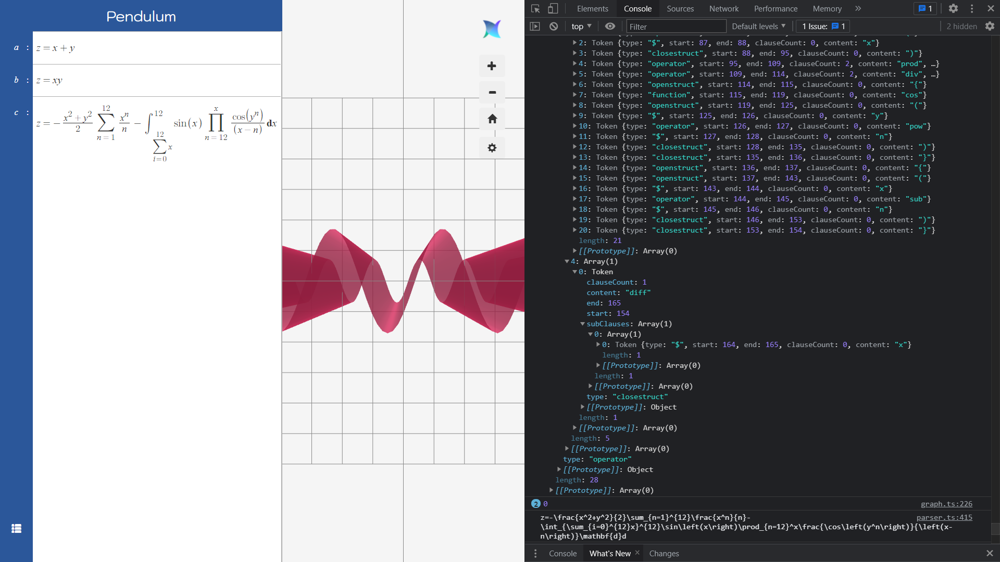

#### 08/08 - 08/13
Made minor updates to linear parsing such as adding the factorial function `!` into the macros and implementing the invisible dot rule. Further specified the shunting yard algorithm as 
a part of node parsing inside documentation: broke down the mechanisms behind the shunting yard algorithm to understand its implications and limitations
when it comes to reading specific sequences of expressions, conceptualized the compareAssociativity metric for handed associativity checking,
analyzed the general applicability of the enhanced shunting yard implementation. Minor changes to graph.ts.

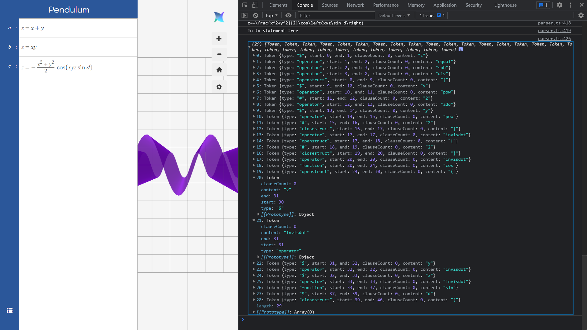

#### 08/14
Implemented Shunting Yard parser for conversion from token list into statement trees at the root level (ignoring sub-clauses). Discussed user-defined function 
clausing with Derek, implemented the default behavior of linear parser when encountering "f(...)" like syntax, that the token type gets changed to funcVar and 
tentative toward both the algebraic type or the function type, and the content inside parenthesis gets parsed into a sub-clause of 
the token f. The evaluation method of this 'f', that is whether there is an invisible multiplication between 'f' and '(', or if
what is inside '(...)' will serve as the parameter of 'f', will be determined within the core module after dependency walks.

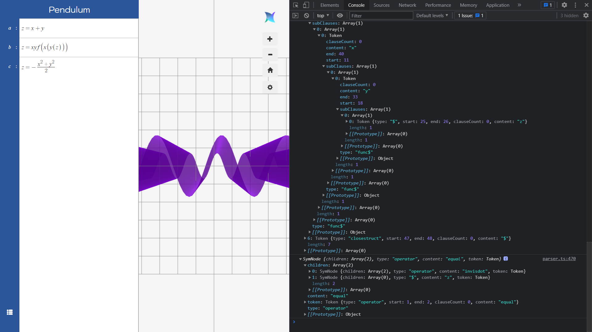

#### 01/16/22-01/18/22
Completion of core infrastructure, including context maintenance, piScript generation, parameterized function definition, evaluation
handle creation. Created Pendulum class as the centralized controller. Linked graphics, core and ui through Pendulum methods.
Major bug fixes for UI, parser, and core module. Fixed compatibility of 'func$' in syParsing, added multi-parameter function 
clause parsing. Improved coverage of 'invisDot' (invisible dot) insertions. Further specified behavior of equation resolution
pertaining label guessing and equation structure recognition, as well as the shunting yard parsing behavior of function clauses
and larger operands (e.g `\sum_{n=12}^5`).

Multivariate function definition:
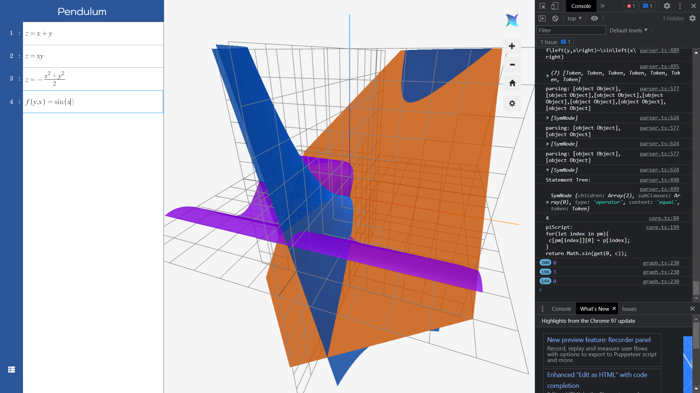

'func$' typed function clause pseudo-multiplication:

#### 01/19/22
User interface development. Outlined the module-based nature and the loading architecture of UI. Implemented the drag bar
(the divider) and the defSettingsBtn, which allows users to adjust the size of the definition area to give more space to the
canvas. Minor font adjustments. Slight adjustments to the css layouts of the defpanel to produce more consistent results.

#### 01/23/22
Fix SymNode labeling and direct definition (without equal sign) in core module. Specify and implement 
function-parenthesis collapse for expressions like `\sin\left(x\right)` in syParsing. Line up and implement 
minor changes in operator associativity. Now nested parameterized variables are fully functioning. Experiment with
orthographic camera.
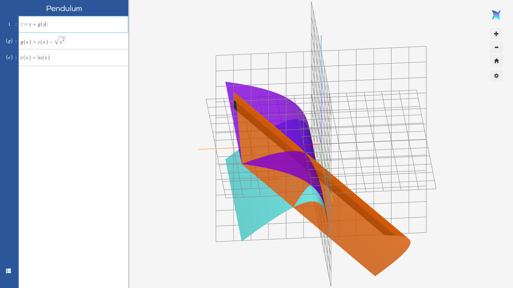

#### 05/25/22
Design conventions for vector and array variables, including syntax and operation overloading. 
Plan out implementation strategies in core and parser.

#### 05/26/22
Implement vector variable labeling. `\vec{x}` now ges parsed into '$' typed token with content ">x". 
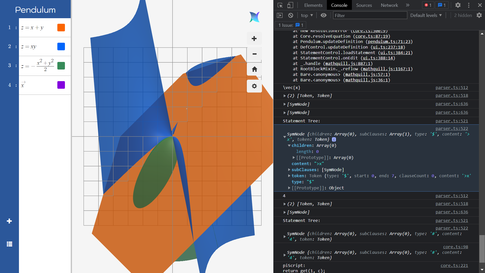

#### 05/27/22
Discuss the necessity for dynamic typing in quantities. 
Specify in further detail implementation decisions and algorithms for achieving space and time efficiency 
in vector computations. Devised recycling system for dealing with large number of intermediate 
containers required for vector and array operations.

#### 05/31/22
Implement major functions and operators in Arithmetics for typed quantities. Add parsing of imaginary
constant i into the parser. Configure visualization for complex quantities. Now Pendulum (almost) fully
supports computation and visualization of functions with complex values.

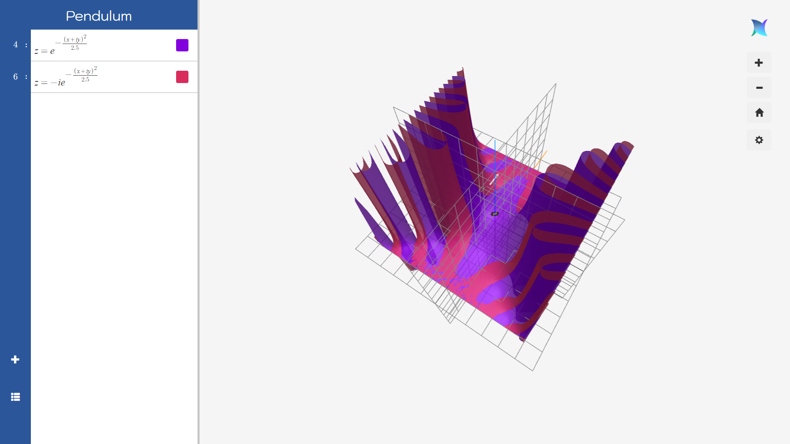
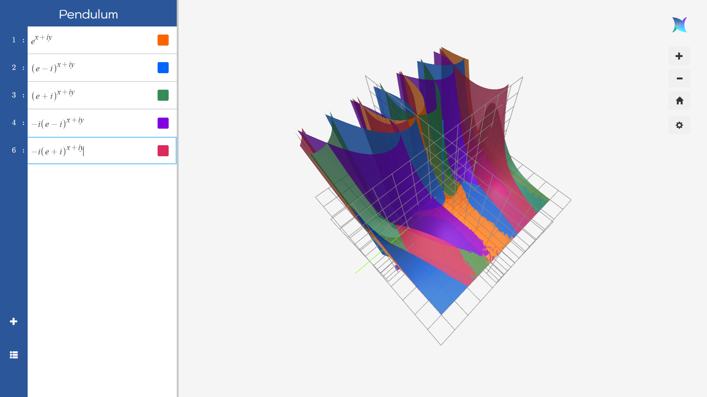

Modify parameterized variable access implementation to accommodate for occurrences of the same variable
in an expression with non parameterized access style.

Redesign logic of parameterized variable accesses and specify its implementations. Reconsider context usage
in light of parameterized function calls and vectorized quantities. Recognized the need for quantities
to be locked by count instead of by boolean. 

#### 06/02/22-06/9/22
Implement vector, vector field visualizations. Minor restructuring of core. Implement
visualization type analysis methods and designate Evaluable as the visualization command object.
 Implement
parametric visualization, group visualization of arrays of cartesian graphs.
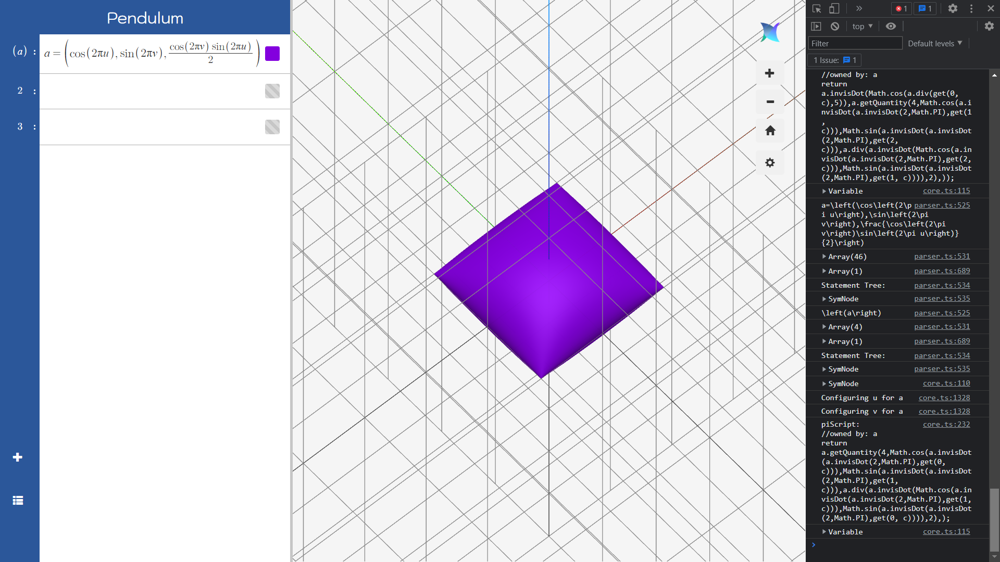
Design and implement function 
visibility toggle. Performance optimization through core restructuring and time
dependence information of graphs. Quantity lock and release are now recursive, as necessarily demanded by
the logic of vector-typed evaluations. As of right now, `t` serves as the monotone increasing
time dependent variable for establishing time dependency and animation of visualization targets.

#### 06/10/22
Implement grouped visualization for arrays of parametric functions and arrays of vectors. Improve logic
for type broadcasting in additions and subtractions within Arithmetics. Now one can add and subtract quantities of any
two types in an expression.

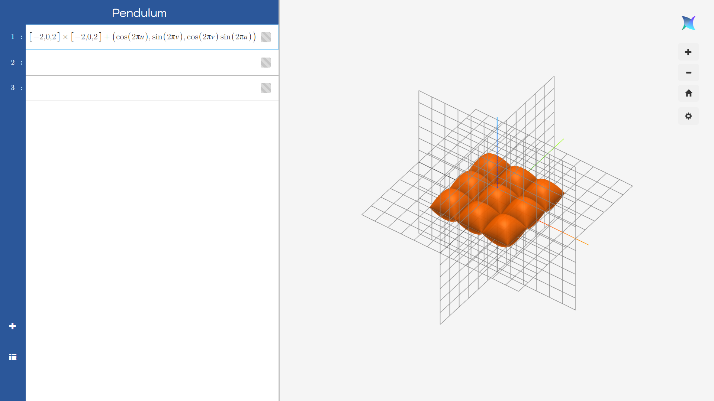

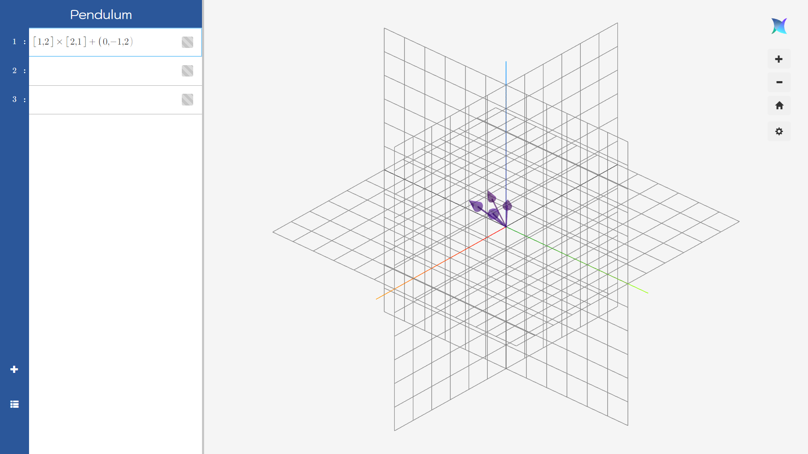

#### 06/19/22
Implement summation clause
